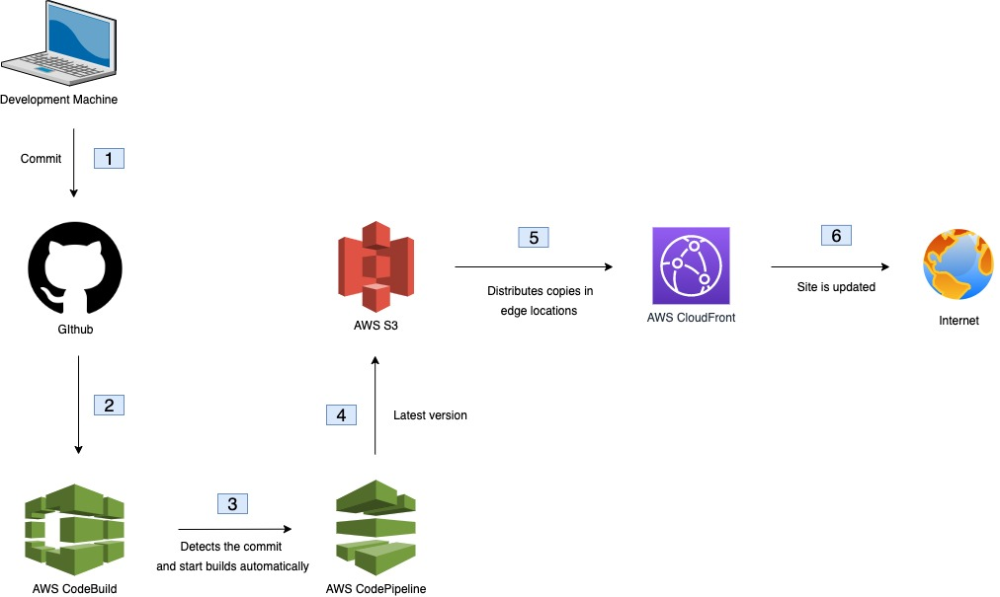

# RoarCoder FrontEnd Microservice

This project is frontend (only) of my website, [RoarCoder](https://roarcoder.dev).

# Motivation

The goal is to convert the hardcoded information to come dynamically from the API.

# Chosen Technologies and Why

## AWS CodeBuild 
I wanted to have a quick and easy way to build my code. From my research, CodeBuild allowed to do, however, I didn't know how to impelement it. So, I chose to learn it by doing it.

## AWS CodePipeline
I chose this as my continious delivery service because it enabled me to build and release my code more frequently. Again, I didn't know how to implement it with Github and CodeBuild to automate the process. Hence, I chose to learn it by doing it.

## VS Code
Light-weight text editor which I am comfortable using was required.

## AJAX
Foreground process shouldn't stop and wait for the background process (API call) to finish. AJAX allowed to do that asynchronously

## jQuery
I wanted to do more with less code. Hence, jQuery, a Javascript library, allowed me to. Plus point was it's light-weight too

# Prerequisites

Familiarity with AJAX, jQuery, HTML, CSS, AWS Platform and AWS account

# Getting Started

1. Install [Ruby](https://www.ruby-lang.org/en/downloads/) version 2.4.0 or above (check by `ruby -v`)
2. Install [RubyGems](https://rubygems.org/pages/download) installed (check by runnung `gem -v`) 
3. Install [Jekyll](https://jekyllrb.com/docs/installation/macos/) for macOS

# Running The Project

## Locally

1. Clone or download the repository.
2. Open in Visual Studio Code or any of your favourite text editor.
3. Check if it builds successful by running `jekyll serve` in the terminal. If you get an error, it's most likely that you don't have the gem `jekyll-watch` as your dependancy.
4. How to install jekyll watch? See next two steps
5. Include `gem 'jekyll-watch'` in your GemFile.
6. Repeat step 3.
7. If everything goes well, TADAAAAA!! Your coolest Jekyll website is running locally.
8. OPTIONAL - Get production version of your website by running `jekyll build` and run then `jekyll serve` in the `_site`'s folder

# The flow

# Pipeline process
Whenever the commit is made in Github(configured as a source stage), it's automatically detected by CodePipeline. Then the build starts in CodeBuild (configured as a build stage) which installs all the dependencies in `buildspec.yml` file. Finally, after a successful build, the file(s) are uplodeded to S3 automatically.
 
## Additional Information

**Buildspec file:**

This file contains the following phases:

1. Install
    * Installs all the dependencies that are needed for a successfull build

2. Build
    * Executes the build process

3. Post-Build
    * Executes what's needed to be done after the build as the name suggests